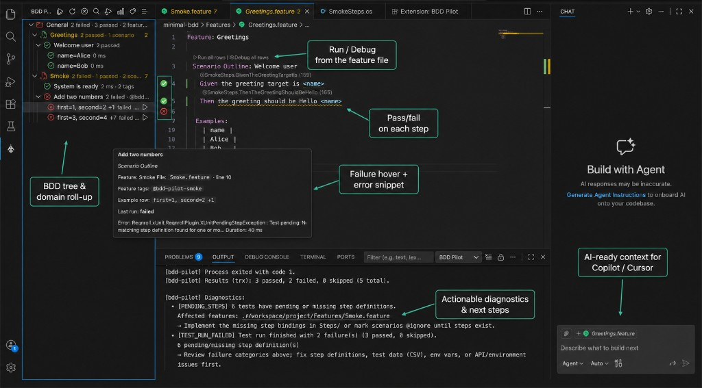
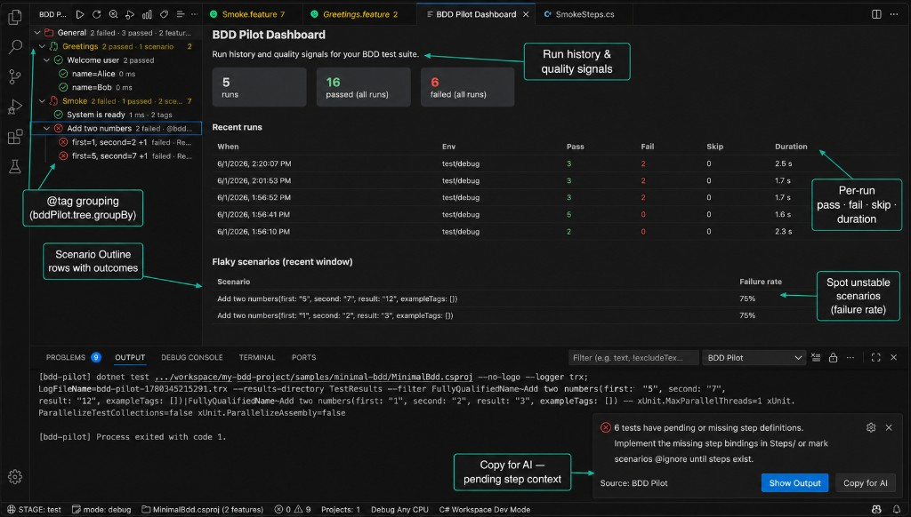

# BDD Pilot

[](./LICENSE)

**Run Reqnroll, SpecFlow, and Cucumber-style BDD tests from VS Code or Cursor** —
without hand-building `dotnet test --filter` strings or digging through raw console output.

BDD Pilot is the **execution layer** for .NET Gherkin projects: discover scenarios in a
**domain or @tag tree**, run from the sidebar, native **Test Explorer**, or **CodeLens**,
see pass/fail on every row (including **Scenario Outline** examples), and get **actionable
diagnostics** when builds, NuGet, Playwright, or step bindings break.

**Stable v1.0** — environment-aware runs (`STAGE`), sanitized logs, **AI-ready failure
context** for Copilot/Cursor, and **post-run feedback** (error snippets in hover + optional
summary toast). Framework-agnostic: any suite that runs through `dotnet test` (API,
Playwright, UI, etc.).

> **Reqnroll on VS Code:** the official Reqnroll extension targets Visual Studio 2022/2026.
> For **VS Code / Cursor**, use BDD Pilot to run tests and [**BDD Guardian**](https://github.com/AngHelll/bdd-guardian)
> to navigate step bindings — install both.

## BDD extension family

BDD Pilot focuses on **running** tests. For **navigation and step bindings**, use
[**BDD Guardian**](https://github.com/AngHelll/bdd-guardian) — they complement each
other and can be installed side by side:

| Extension | Role |
|-----------|------|
| [**BDD Guardian**](https://github.com/AngHelll/bdd-guardian) | Go to Definition, CodeLens on steps, binding diagnostics, Coach mode |
| **BDD Pilot** (this repo) | Test tree, `dotnet test` execution, TRX/Cucumber results, run history |

Guardian answers *“where is this step implemented?”* — Pilot answers *“run this
scenario and show me what failed.”*

## Screenshots

**Run & diagnose from the editor** — domain tree, CodeLens, step outcomes, failure
hover, diagnostics, and AI-ready context:



**Dashboard & @tag grouping** — run history, flaky scenarios, tag tree, and pending-step
toast with **Copy for AI**:



## Install

- **VS Code Marketplace:** search **BDD Pilot** (publisher [anghelll](https://marketplace.visualstudio.com/items?itemName=anghelll.bdd-pilot)), or run:
  ```text
  ext install anghelll.bdd-pilot
  ```
- **Manual / pre-release:** download the `.vsix` from [GitHub Releases](https://github.com/AngHelll/bdd-pilot/releases) → Extensions → `…` → **Install from VSIX…**
- **Try the sample:** open [`samples/minimal-bdd/`](./samples/minimal-bdd/) as the workspace after installing.

## Features

### Discovery & run
- **Native Test Explorer** (`TestController`): Run and Debug profiles with results; follows `bddPilot.tree.groupBy` (`domain` or `@tag`); descriptions mirror BDD tree settings (`tree.durationDisplay`, `tree.tagDisplay`) and locale for outcomes/roll-ups.
- **BDD Pilot side view**: Domain → Feature → Scenario tree from `.feature` files,
  with tag badges. Domain grouping uses a `Feature/` or `Features/` folder.
- **Pilot summary row** at the top of the tree — last run status (`3 passed`, `Running…`);
  click for dashboard and history. Toolbar **Dashboard** icon (`$(graph)`) opens the same panel.
- **Tree display mode** (`bddPilot.tree.displayMode`): `detailed` (roll-ups on folders, default)
  or `compact` (less duplicate roll-ups; outcomes emphasized on leaves).
- **CodeLens** on Feature, Scenario, and **Scenario Outline example rows** (Run / Debug).
- **One-click run**: domain, feature, scenario, tag, or **Scenario Outline row** —
  the correct `dotnet test --filter` is built automatically.
  - Feature → `FullyQualifiedName~<Feature>Feature`
  - Scenario → `FullyQualifiedName~<Feature>Feature.<Scenario>`
  - Outline row → `DisplayName~parameter: %22…%22, value: %22…%22` (single Theory row)
  - Tag → `Category=<tag>`
- **Tree search** to filter by name, tag, or path.
- **Re-run failed** from the last run's filter.
- **Saved execution profiles** for common filters.

### Environment & execution
- **UI language** (`bddPilot.locale`: `auto` | `en` | `es`) — status bar, dashboard, CodeLens, palette, and dialogs follow VS Code UI language when set to `auto`.
- **Environment selector** (`dev`/`test`/`stg`/`prod`) in the status bar — sets
  `STAGE` for the run.
- **Parallelism mode** (`debug`/`parallel`/`ci`) passed as xUnit RunSettings, so
  the project's `xunit.runner.json` is never mutated on disk.
- **Reliable execution**: progress UI, cancellation, and live streaming to the
  *BDD Pilot* output channel.
- **Debug** launches `dotnet test` under the .NET debugger (`coreclr`).

### Results & diagnostics
- **TRX + Cucumber JSON**: scenarios decorated with pass / fail / skip and duration.
- **Webview dashboard**: run history (with **Scope** per run, e.g. All tests / `@tag`), totals, and flaky scenario table.
- **Evidence links** on failures (screenshots, traces, videos when present).
- **Actionable diagnostics**: missing SDK from `global.json`, private NuGet feed/auth
  errors, vulnerability-as-error, filter mismatches, broken Playwright drivers, etc.
- **AI-ready failure context**: copy structured markdown of the last failed run to the
  clipboard for Cursor/Copilot (no embedded LLM — review before sharing externally).
- **Post-run feedback**: error snippets on failed scenarios (hover + description), localized
  outcomes, optional summary toast (`bddPilot.feedback.postRunToast`).

## Security

- The extension **never reads or stores credentials**. Secrets continue to come
  from the project's own `.env` mechanism.
- An optional `config/.env.<stage>` file is loaded into the test process's
  environment **in memory only** (never logged or persisted).
- All output is **sanitized** before being written to the channel (client
  secrets, passwords, tokens, JWTs, connection strings are redacted).
- Running against `stg`/`prod` requires an **explicit modal confirmation**
  (configurable).

### Optional `config/.env.<stage>` files

BDD Pilot can merge stage-specific variables into the test process when you run
from VS Code. This is **optional** — your project may already load its own
`.env` files inside hooks or step definitions.

1. Create a `config/` folder next to (or above) your test `.csproj`.
2. Copy [`config/env.example`](./config/env.example) to `config/.env.test`
   (or `.env.dev`, `.env.stg`, `.env.prod`).
3. Select the matching **STAGE** in the status bar before running.

Load order: `config/.env.<stage>` then `config/.env.local` (overrides). Values
are merged in memory only; see [Security](#security) above.

## Architecture

```
src/
├── core/          # Pure logic, no VS Code API — unit tested
│   ├── gherkin/   # .feature parser, grouping, discovery
│   ├── runner/    # dotnet test arg/env building + spawn
│   ├── results/   # TRX + Cucumber parsers, evidence, run history
│   ├── diagnostics/ # error-output analyzer
│   └── config/    # stages, modes, profiles, project locator, .env loader
├── providers/     # Tree, TestController, CodeLens, dashboard, RunService
├── security/      # env guard policy + output sanitizer
└── extension.ts   # activation + commands wiring
```

The `core/` layer has no dependency on the VS Code API, so it is fully unit
testable and reusable (e.g. a future CLI).

## Configuration

| Setting | Default | Description |
|---------|---------|-------------|
| `bddPilot.projectPath` | `""` | Path to test project dir, `.csproj`, or `.sln`. Empty = auto-detect; use status bar **project** picker when multiple exist. |
| `bddPilot.defaultStage` | `test` | Default `STAGE`. |
| `bddPilot.defaultMode` | `debug` | Default parallelism mode. |
| `bddPilot.requireConfirmationForStages` | `["stg","prod"]` | Stages that require confirmation. |
| `bddPilot.dotnetPath` | `dotnet` | Path to the `dotnet` executable. |
| `bddPilot.tree.displayMode` | `detailed` | Tree density: `detailed` (roll-ups on folders) or `compact` (less duplicate roll-ups). |
| `bddPilot.tree.tagDisplay` | `count` | How tags show in the tree: `hidden`, `count`, `compact`, or `full`. |
| `bddPilot.tree.compactTagLimit` | `2` | Max tags when `tagDisplay` is `compact`. |
| `bddPilot.tree.durationDisplay` | `auto` | Durations: `auto`, `ms`, `seconds`, or `compact`. Hover shows exact ms. |
| `bddPilot.filter.featureClassSuffix` | `Feature` | Suffix for `FullyQualifiedName` filters (Reqnroll/SpecFlow default). |
| `bddPilot.filter.tagTraitName` | `Category` | xUnit trait name for `@tags` in `--filter`. |
| `bddPilot.filter.outlineRowFilter` | `displayName` | `displayName` = one outline row; `scenarioOnly` = whole Theory. |

Tree items use **label = name only**; tags and run metadata appear in a short
**description** (e.g. `6 tags`, `2.3 s`). **Hover** shows full tag lists and
duration as `2.3 s (2341 ms)`.

## Requirements

- VS Code 1.90+
- .NET SDK (any feeds your project needs must be reachable / authenticated on
  your machine — BDD Pilot does not manage credentials)

## Development

```bash
npm install
npm run compile      # type-check
npm run lint
npm run test:unit    # core unit tests (node:test) + sample smoke
npm run build        # bundle with esbuild -> dist/extension.js
npm run package      # produce a .vsix
npm run dogfood      # automated pre-release smoke (lint, tests, VSIX, sample dotnet test)
```

Press `F5` in VS Code to launch the Extension Development Host.

### Sample BDD project

[`samples/minimal-bdd/`](./samples/minimal-bdd/) is a minimal Reqnroll + xUnit project used for CI smoke
(`dotnet test`) and to validate feature discovery / filter mapping in unit tests. Open that folder as the
workspace to dogfood BDD Pilot on a clean layout.

## Roadmap

See [ROADMAP.md](./ROADMAP.md). Current release is **v1.2.3** (tree display mode, pilot summary row, dashboard scope labels).
Works alongside
[BDD Guardian](https://github.com/AngHelll/bdd-guardian).

## Contributing

Contributions are welcome! See [CONTRIBUTING.md](./CONTRIBUTING.md). BDD Pilot is
open source under the [MIT License](./LICENSE).
