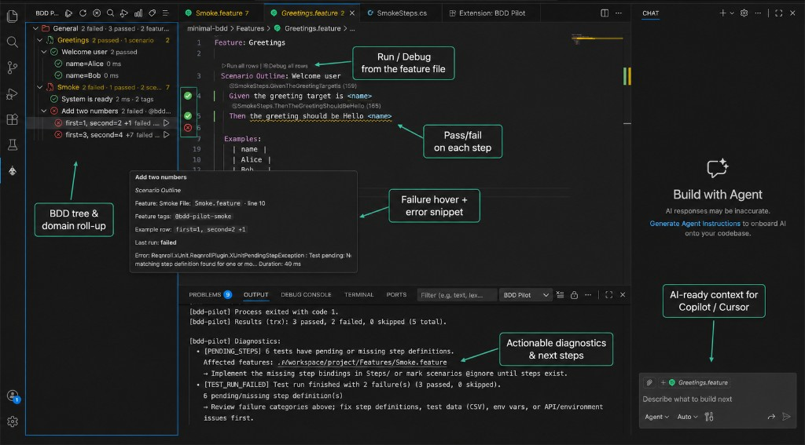
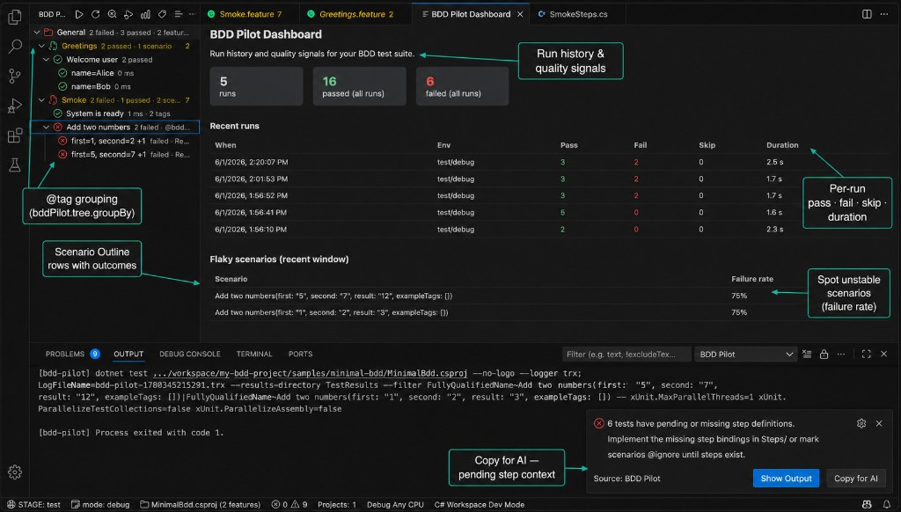
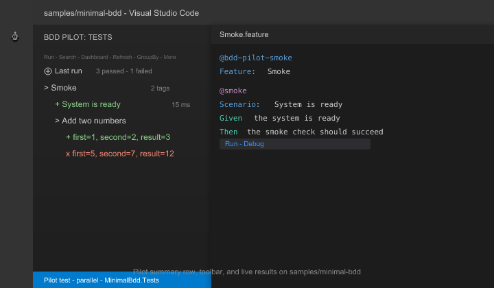

# BDD Pilot

[](./LICENSE)

**Run Reqnroll, SpecFlow, and Cucumber-style BDD tests from VS Code or Cursor** —
without hand-building `dotnet test --filter` strings or digging through raw console output.

BDD Pilot is the **execution layer** for .NET Gherkin projects: discover scenarios in a
**domain or @tag tree**, run from the sidebar, native **Test Explorer**, or **CodeLens**,
see pass/fail on every row (including **Scenario Outline** examples), and get **actionable
diagnostics** when builds, NuGet, Playwright, or step bindings break.

**Stable v1.0** — environment-aware runs (`STAGE`), sanitized logs, **AI-ready failure
context** for Copilot/Cursor, and **post-run feedback** (error snippets in hover + optional
summary toast). Framework-agnostic: any suite that runs through `dotnet test` (API,
Playwright, UI, etc.).

> **Reqnroll on VS Code:** the official Reqnroll extension targets Visual Studio 2022/2026.
> For **VS Code / Cursor**, use BDD Pilot to run tests and [**BDD Guardian**](https://github.com/AngHelll/bdd-guardian)
> to navigate step bindings — install both.

## BDD extension family

BDD Pilot focuses on **running** tests. For **navigation and step bindings**, use
[**BDD Guardian**](https://github.com/AngHelll/bdd-guardian) — they complement each
other and can be installed side by side:

| Extension | Role |
|-----------|------|
| [**BDD Guardian**](https://github.com/AngHelll/bdd-guardian) | Go to Definition, CodeLens on steps, binding diagnostics, Coach mode |
| **BDD Pilot** (this repo) | Test tree, `dotnet test` execution, TRX/Cucumber results, run history |
| [**BDD Jarvis**](https://github.com/AngHelll/bdd-jarvis) | Workspace QA analysis, context packs — consumes Pilot Run API when available |

Pilot exposes a read-only [**Extension API**](docs/EXTENSION_API.md) (`PilotRunApiV1`) for in-process consumers such as Jarvis. TRX-on-disk remains the fallback when the API is absent.

Guardian answers *“where is this step implemented?”* — Pilot answers *“run this
scenario and show me what failed.”*

## Screenshots

**Run & diagnose from the editor** — domain tree, CodeLens, step outcomes, failure
hover, diagnostics, and AI-ready context:



**Dashboard & @tag grouping** — run history, flaky scenarios, tag tree, and pending-step
toast with **Copy for AI**:



**Tree & toolbar** — pilot summary row, codicon toolbar, and domain tree:



## Install

- **VS Code Marketplace:** search **BDD Pilot** (publisher [anghelll](https://marketplace.visualstudio.com/items?itemName=anghelll.bdd-pilot)), or run:
  ```text
  ext install anghelll.bdd-pilot
  ```
- **Manual / pre-release:** download the `.vsix` from [GitHub Releases](https://github.com/AngHelll/bdd-pilot/releases) → Extensions → `…` → **Install from VSIX…**
- **Try the sample:** open [`samples/minimal-bdd/`](./samples/minimal-bdd/) as the workspace after installing.

## Who it's for

| | |
|---|---|
| **For** | Reqnroll, SpecFlow, and Cucumber-style **.NET BDD** projects with `.feature` files — run, debug, and diagnose from VS Code or Cursor |
| **Not for** | Repos **without** `.feature` files, or generic xUnit/NUnit test runners (use [C# Dev Kit](https://marketplace.visualstudio.com/items?itemName=ms-dotnettools.csdevkit) instead) |

## Features

### Discovery & run
- **Native Test Explorer** (`TestController`): Run and Debug profiles with results; follows `bddPilot.tree.groupBy` (`domain` or `@tag`); descriptions mirror BDD tree settings (`tree.durationDisplay`, `tree.tagDisplay`) and locale for outcomes/roll-ups.
- **BDD Pilot side view**: Domain → Feature → Scenario tree from `.feature` files,
  with tag badges. Domain grouping uses a `Feature/` or `Features/` folder.
- **Pilot summary row** at the top of the tree — last run status (`3 passed`, `Running…`);
  dynamic icon while tests run (`loading~spin`) or debug (`debug-alt`); **live progress** in the
  description during runs (`7/19 · 2 failed`); **post-run diagnostic chip**
  (top actionable hint from the last run) with severity icon (`warning` / `info`); **filter chip** when
  tree search is active; **unmapped chip** after a scoped run when scenarios did not match TRX
  (`N unmapped — Show Unmapped`, command **BDD Pilot: Show Unmapped Scenarios**). Click opens
  dashboard (or the unmapped QuickPick when that chip is shown).
  Activity bar **BDD Pilot** icon shows a badge during active runs. Toolbar **Dashboard** icon (`$(graph)`) opens the same panel.
- **Tree toolbar** — Run · Search · Dashboard · Refresh · GroupBy · **More** (`…`) overflow for Re-run Failed and Execution Profiles; **Debug** inline on rows (`bddPilot.debugNode`); **Cancel** only while a run is active.
- **Tree display mode** (`bddPilot.tree.displayMode`): `detailed` (roll-ups on folders, default)
  or `compact` (less duplicate roll-ups; outcomes emphasized on leaves).
- **CodeLens** on Feature, Scenario, and **Scenario Outline example rows** (Run / Debug).
- **One-click run**: domain, feature, scenario, tag, or **Scenario Outline row** —
  the correct `dotnet test --filter` is built automatically.
  - Feature → `FullyQualifiedName~<Feature>Feature`
  - Scenario → `FullyQualifiedName~<Feature>Feature.<Scenario>`
  - Outline row → `DisplayName~parameter: %22…%22, value: %22…%22` (single Theory row)
  - Tag → `Category=<tag>`
- **Tree search** to filter by name, tag, or path. Active filter shows on the summary row; **Run filtered** replaces Run All while filtered. Use `@tag` for tag-only matching. Persists per workspace. **Ctrl+F** highlights in the list only — Pilot Search controls run scope. Test Explorer does not inherit the tree filter.
- **Re-run failed** from the last run's filter.
- **Saved execution profiles** for common filters.

### Environment & execution
- **UI language** (`bddPilot.locale`: `auto` | `en` | `es`) — status bar, dashboard, CodeLens, palette, and dialogs follow VS Code UI language when set to `auto`.
- **Execution hub** (status bar) — compact branded chip `$(beaker) Pilot` with STAGE, mode, and project (`bddPilot.statusBar.display`: `compact` default, `detailed` for legacy four items). Click to open unified settings QuickPick with descriptions for environments and parallelism presets.
- **Environment (STAGE)** (`dev`/`test`/`stg`/`prod`) — sets `STAGE` for the run; stg/prod require confirmation.
- **Parallelism mode** (`debug`/`parallel`/`ci`) passed as xUnit RunSettings, so
  the project's `xunit.runner.json` is never mutated on disk.
- **Reliable execution**: progress UI, cancellation, and live streaming to the
  *BDD Pilot* output channel.
- **Debug** launches `dotnet test` under the .NET debugger (`coreclr`).

### Results & diagnostics
- **TRX + Cucumber JSON**: scenarios decorated with pass / fail / skip and duration.
- **Tree mapping report**: after a **scoped** run, Output shows `mapped/inScope` counts; when some
  scenarios lack a TRX match (`not_in_trx`), lists them (capped) and the palette command
  **Show Unmapped Scenarios** opens a QuickPick to jump to the `.feature` line.
- **Webview dashboard**: run history (with **Scope** per run, e.g. All tests / `@tag`), totals, **enriched flaky scenario table** (failure rate, avg duration, last error, click to open `.feature`), and **last-run diagnostic card** (same top-1 rule as the tree summary row).
- **Evidence links** on failures (screenshots, traces, videos when present).
- **Actionable diagnostics**: missing SDK from `global.json`, private NuGet feed/auth
  errors, vulnerability-as-error, filter mismatches, broken Playwright drivers, pending step definitions, etc.
  Surfaced in **Output** (`summary` or `full`), **post-run toast**, **tree summary chip**, and **dashboard card**.
- **AI-ready failure context**: copy structured markdown of the last failed run to the
  clipboard for Cursor/Copilot (no embedded LLM — review before sharing externally).
  Optional **`bddPilot.ai.rehydrateFromTrx`** (default off) rebuilds that context after Reload
  from the latest Pilot TRX; the markdown notes when the source was rehydrated (may be stale).
- **Post-run feedback**: error snippets on failed scenarios (hover + description), localized
  outcomes, optional summary toast (`bddPilot.feedback.postRunToast`).

### Iconography

BDD Pilot uses **VS Code codicons** for actions and outcomes, plus two **brand assets** that share the **same silhouette** (radar + pilot):

| Asset | Role |
|-------|------|
| **`media/icon.png`** | Marketplace / Extensions discovery — color tile derived from `pilot.svg` (`media/icon-marketplace.svg` source) |
| **`media/pilot.svg`** | Activity bar sidebar — monochrome, theme-aware (`currentColor`) |

| Area | Icons | Meaning |
|------|-------|---------|
| Activity bar | `pilot.svg` | BDD Pilot entry; badge `1` during run/debug |
| Status bar | `$(beaker) Pilot` | Execution hub (STAGE, mode, project) |
| Toolbar | `run-all`, `search` / `search-fuzzy`, `stop`, `graph`, `refresh`, `folder` / `tag`, `ellipsis` | Run · Search · Cancel (running) · Dashboard · Refresh · GroupBy · More |
| Summary row | `history`, `loading~spin`, `debug-alt`, `warning`, `info` | Idle · running · debugging · error · warning |
| Tree outcomes | `pass`, `error`, `circle-slash`, `beaker`, `list-tree` | Passed / failed / skipped / pending scenario / pending outline |
| Containers | `folder`, `file-code`, `tag` + tint `testing.icon*` | Domain / feature / tag group roll-up |

**ForgeOne family:** Pilot = execution · [BDD Guardian](https://github.com/AngHelll/bdd-guardian) = navigation & step bindings — Pilot focuses on execution icons only.

## Security

- The extension **never reads or stores credentials**. Secrets continue to come
  from the project's own `.env` mechanism.
- An optional `config/.env.<stage>` file is loaded into the test process's
  environment **in memory only** (never logged or persisted).
- All output is **sanitized** before being written to the channel (passwords,
  tokens, JWTs, connection strings, AWS access key ids, PEM private keys, and
  similar patterns are redacted).
- Running against `stg`/`prod` requires an **explicit modal confirmation**
  (configurable via `bddPilot.requireConfirmationForStages`).
- **Production opt-in:** `bddPilot.security.allowProductionRuns` defaults to
  **false** — STAGE=`prod` is blocked until you enable the setting; with it on,
  the production confirmation modal still applies.

### Optional `config/.env.<stage>` files

BDD Pilot can merge stage-specific variables into the test process when you run
from VS Code. This is **optional** — your project may already load its own
`.env` files inside hooks or step definitions.

1. Create a `config/` folder next to (or above) your test `.csproj`.
2. Copy [`config/env.example`](./config/env.example) to `config/.env.test`
   (or `.env.dev`, `.env.stg`, `.env.prod`).
3. Select the matching **STAGE** in the status bar execution hub before running.

Load order: `config/.env.<stage>` → `config/.env.<stage>.local` →
`config/.env.local` (each step overrides earlier keys). Values are merged in
memory only; see [Security](#security) above. Gitignore per-stage locals such as
`config/.env.*.local` and/or `config/.env.local` in your repo.

The [`samples/minimal-bdd`](./samples/minimal-bdd) project includes a tracked
`config/.env.test` placeholder for dogfood and Capa B verification.

## Architecture

```
src/
├── core/          # Pure logic, no VS Code API — unit tested
│   ├── gherkin/   # .feature parser, grouping, discovery
│   ├── runner/    # dotnet test arg/env building + spawn
│   ├── results/   # TRX + Cucumber parsers, evidence, run history
│   ├── diagnostics/ # error-output analyzer
│   └── config/    # stages, modes, profiles, project locator, .env loader
├── providers/     # Tree, TestController, CodeLens, dashboard, RunService
├── security/      # env guard policy + output sanitizer
└── extension.ts   # activation + commands wiring
```

The `core/` layer has no dependency on the VS Code API, so it is fully unit
testable and reusable (e.g. a future CLI).

## Configuration

| Setting | Default | Description |
|---------|---------|-------------|
| `bddPilot.projectPath` | `""` | Path to test project dir, `.csproj`, or `.sln`. Empty = auto-detect; use status bar hub or **Select Test Project** when multiple exist. |
| `bddPilot.statusBar.display` | `compact` | Status bar: `compact` (single hub) or `detailed` (legacy four items). |
| `bddPilot.defaultStage` | `test` | Default `STAGE`. |
| `bddPilot.defaultMode` | `debug` | Default parallelism mode. |
| `bddPilot.requireConfirmationForStages` | `["stg","prod"]` | Stages that require confirmation. |
| `bddPilot.dotnetPath` | `dotnet` | Path to the `dotnet` executable. |
| `bddPilot.run.configuration` | `""` | Optional `dotnet test --configuration`: `Debug`, `Release`, or empty (omit). |
| `bddPilot.run.noBuild` | `false` | When `true`, pass `--no-build` (skip build; requires prior successful build). |
| `bddPilot.run.runSettings` | `""` | Path to a `.runsettings` file (workspace-relative or absolute) for `--settings`. |
| `bddPilot.run.byStage` | `{}` | Per-`STAGE` overrides for `configuration` / `runSettings` (keys `dev`/`test`/`stg`/`prod`). Does **not** load `.env` — only `dotnet test` flags. Example: `{ "stg": { "configuration": "Release", "runSettings": "config/stg.runsettings" } }`. |
| `bddPilot.tree.displayMode` | `detailed` | Tree density: `detailed` (roll-ups on folders) or `compact` (less duplicate roll-ups). |
| `bddPilot.tree.groupBy` | `domain` | Tree grouping: `domain` (folder layout) or `tag` (`@smoke` folders). |
| `bddPilot.tree.tagDisplay` | `count` | How tags show in the tree: `hidden`, `count`, `compact`, or `full`. |
| `bddPilot.tree.compactTagLimit` | `2` | Max tags when `tagDisplay` is `compact`. |
| `bddPilot.tree.durationDisplay` | `auto` | Durations: `auto`, `ms`, `seconds`, or `compact`. Hover shows exact ms. |
| `bddPilot.tree.searchRunCap` | `80` | Confirm before **Run filtered** when match count exceeds cap (`0` = never). |
| `bddPilot.filter.featureClassSuffix` | `Feature` | Suffix for `FullyQualifiedName` filters (Reqnroll/SpecFlow default). |
| `bddPilot.filter.tagTraitName` | `Category` | xUnit trait name for `@tags` in `--filter`. |
| `bddPilot.filter.outlineRowFilter` | `displayName` | `displayName` = one outline row; `scenarioOnly` = whole Theory. |
| `bddPilot.locale` | `auto` | UI language: `auto` (follow VS Code), `en`, or `es`. |
| `bddPilot.diagnostics.extendedRules` | `false` | Opt-in extended post-run rules (cloud, X-Ray, API HTTP). |
| `bddPilot.feedback.diagnosticsInOutput` | `summary` | Output diagnostics: `summary`, `full`, or `off`. |
| `bddPilot.feedback.dotnetVerbosity` | `filtered` | Live `dotnet test` stream in Output: `filtered` (hide discovery/build noise) or `raw`. |
| `bddPilot.feedback.autoShowOutput` | `off` | Auto-show Output when a run finishes: `off`, `onFailure`, or `always`. |
| `bddPilot.feedback.postRunToast` | `failures` | Post-run toast: `off`, `failures`, or `always`. |
| `bddPilot.preRun.bindingGate` | `warn` | Pre-run binding check via BDD Guardian: `off`, `warn`, or `block`. |

Tree items use **label = name only**; tags and run metadata appear in a short
**description** (e.g. `6 tags`, `2.3 s`). **Hover** shows full tag lists and
duration as `2.3 s (2341 ms)`.

## Requirements

- VS Code 1.90+
- .NET SDK (any feeds your project needs must be reachable / authenticated on
  your machine — BDD Pilot does not manage credentials)

## Development

```bash
npm install
npm run compile      # type-check
npm run lint
npm run test:unit    # core unit tests (node:test) + sample smoke
npm run build        # bundle with esbuild -> dist/extension.js
npm run package      # produce a .vsix
npm run dogfood      # automated pre-release smoke (lint, tests, VSIX, sample dotnet test)
npm run release:prep # maintainer gate: dogfood + version↔CHANGELOG + VSIX checklist (no publish)
npm run docs:sync-check  # fail if src/ changed without CHANGELOG.md
```

### Agent / CLI / MCP

**VSIX (recommended):** Install BDD Pilot from a `.vsix`. On VS Code **1.101+** or Cursor with MCP support, the extension registers an MCP server (**BDD Pilot**) in agent mode — no manual `mcp.json` required. After a **failed test run**, the extension writes `TestResults/bdd-pilot-last-failure.json` so the `pilot_failure_context` tool can run with only `projectDir`.

**Repo dev / CI** (clone required):

```bash
npm run pilot -- discover samples/minimal-bdd [--enrich] [--test-target MinimalBdd.csproj]
npm run pilot -- build-filter samples/minimal-bdd --tag smoke
npm run pilot -- failure-context --project-dir samples/minimal-bdd --log path/to/run.log
npm run pilot:mcp    # MCP stdio server (Cursor / Claude Desktop)
```

For manual MCP config (repo clone), copy [`config/mcp.json.example`](./config/mcp.json.example) to `.cursor/mcp.json` and set absolute paths for `bddPilotRepo` and `workspaceFolder`. Set `BDD_PILOT_WORKSPACE_ROOT` to your BDD project root so tool paths stay within the workspace.

**Security:** MCP tool output may include test failure data. Paths are restricted to the workspace root; logs/TRX are size-capped and sanitized — still **review before sharing with external AI** (same as Copy for AI in the extension).

### Agent recipes (Copilot / Cursor)

Enable **BDD Pilot** in the Chat tools picker (agent mode). Paths below assume workspace root = your BDD project (e.g. `samples/minimal-bdd`).

1. **Map the repo** — `pilot_discover_bdd` with `projectDir: "."`. Add `enrich: true` only when you need outline rows from `dotnet test --list-tests` (slower).
2. **Build a filter** — `pilot_build_filter` with `scope: "tag"` and `tag: "smoke"` (or `feature` / `scenario` scope).
3. **After a failure** — run tests from the BDD Pilot panel, then `pilot_failure_context` with only `projectDir: "."` (uses `TestResults/bdd-pilot-last-failure.json`).
4. **Reopen workspace** — on activate, Pilot rehydrates TRX outcomes; narrative skip reasons (`not_in_trx` / `canceled` from the last scoped run) restore when the TRX matches that run; if the latest TRX has failures, the last-failure artifact is written so step 3 works without a new run.

Repo CLI equivalents:

```bash
npm run pilot -- discover . --enrich          # optional enrich
npm run pilot -- build-filter . --tag smoke
npm run pilot -- failure-context --project-dir .
```

Press `F5` in VS Code to launch the Extension Development Host.

### Sample BDD project

[`samples/minimal-bdd/`](./samples/minimal-bdd/) is a minimal Reqnroll + xUnit project used for CI smoke
(`dotnet test`) and to validate feature discovery / filter mapping in unit tests. Open that folder as the
workspace to dogfood BDD Pilot on a clean layout.

## Roadmap

See [ROADMAP.md](./ROADMAP.md). Current release is **v1.16.0**. Requires [BDD Guardian](https://github.com/AngHelll/bdd-guardian) v0.8.3+ for optional pre-run binding checks.
Works alongside
[BDD Guardian](https://github.com/AngHelll/bdd-guardian).

## Contributing

Contributions are welcome! See [CONTRIBUTING.md](./CONTRIBUTING.md). BDD Pilot is
open source under the [MIT License](./LICENSE).
