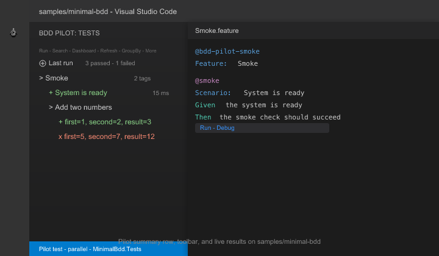
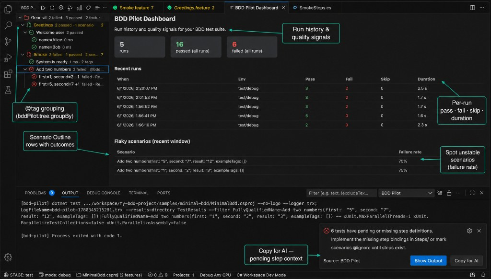
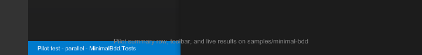
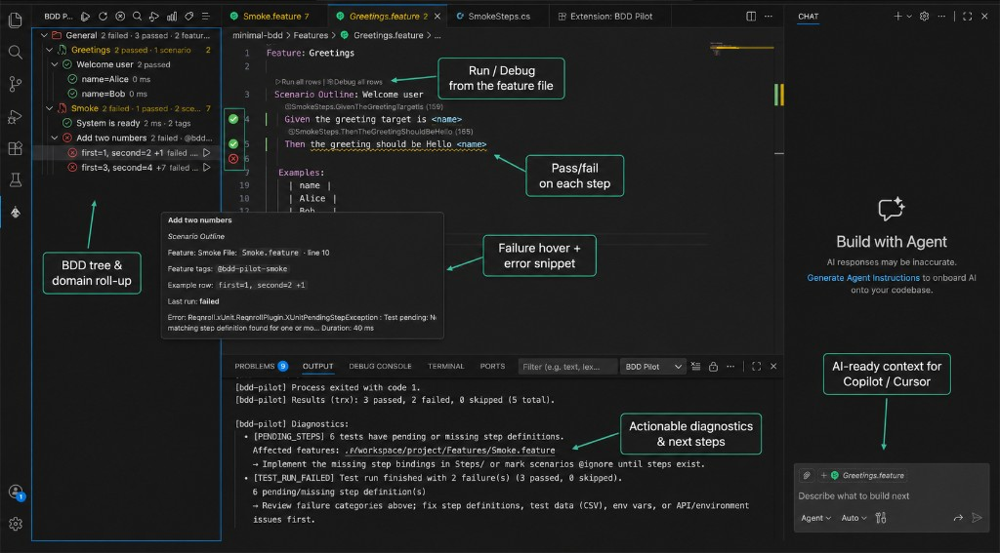

# BDD Pilot

**Run Reqnroll and SpecFlow scenarios from VS Code and Cursor — one click, the right `dotnet test` filter, readable results.**

[](https://marketplace.visualstudio.com/items?itemName=anghelll.bdd-pilot)
[](https://marketplace.visualstudio.com/items?itemName=anghelll.bdd-pilot)
[](https://open-vsx.org/extension/anghelll/bdd-pilot)
[](./LICENSE)

The official Reqnroll extension targets Visual Studio. On VS Code and Cursor you're left hand-writing `dotnet test --filter` strings and scrolling raw console output to find which scenario failed. BDD Pilot gives you a Gherkin-shaped test tree, runs exactly what you click, and maps every result back to its scenario.



## Why Pilot

- **Run by domain, feature, scenario, `@tag`, or a single Scenario Outline row.** Pilot builds the filter for you.
- **See results on the scenario, not the test method.** TRX and Cucumber JSON outcomes land on each `.feature` row, with the error snippet on hover.
- **Know why it failed.** Missing SDK, private NuGet feed, broken Playwright drivers, and pending steps are diagnosed in plain words.
- **Switch environments safely.** Pick `STAGE` (`dev` / `test` / `stg` / `prod`) from the status bar; `stg` and `prod` ask for confirmation, and `prod` stays blocked until you opt in.
- **Hand the failure to your AI assistant.** Copy a sanitized failure summary for Copilot or Cursor, or let the agent read it through the built-in MCP tools.

## Quick start

1. Install BDD Pilot:
   - **VS Code:** Extensions view → *BDD Pilot*, or `ext install anghelll.bdd-pilot`.
   - **Cursor, VSCodium, and other Open VSX editors:** search *BDD Pilot* in Extensions ([Open VSX listing](https://open-vsx.org/extension/anghelll/bdd-pilot)).
2. Open a .NET solution with `.feature` files (Reqnroll or SpecFlow, any test framework that runs through `dotnet test`).
3. Open the **BDD Pilot** view in the Activity Bar and press **Run** on any row.

No project at hand? Open [`samples/minimal-bdd/`](./samples/minimal-bdd/) from this repo.

## Who it's for

| | |
|---|---|
| **For** | .NET BDD projects with `.feature` files (Reqnroll, SpecFlow) — API, UI, or Playwright suites |
| **Not for** | Repos without `.feature` files, or plain xUnit/NUnit suites — use [C# Dev Kit](https://marketplace.visualstudio.com/items?itemName=ms-dotnettools.csdevkit) |

Pilot works **alongside** Test Explorer, not instead of it: Test Explorer for unit tests, Pilot for scenarios.

| BDD Pilot | Test Explorer / C# Dev Kit |
|-----------|----------------------------|
| Tree by **domain** folder or **@tag** | Assembly / class / method |
| **STAGE** picker and per-stage env files | Generic run settings |
| Results mapped to **scenarios**, including Outline rows | Results per test method |
| Run history, flaky scenarios, last-run diagnosis | Results list |

## Features

### Run what you click

- **Tree view** grouped by domain (`Features/` folders) or by `@tag`, with pass / fail / skip and duration on every row.
- **CodeLens** Run / Debug above each Feature, Scenario, and Scenario Outline example row.
- **Native Test Explorer** integration with Run and Debug profiles.
- **Search** the tree by name, tag, or path, then **Run filtered**.
- **Re-run failed**, saved **execution profiles**, and **Cancel** that stops the whole `dotnet` / testhost / browser process tree.
- **Copy effective command** gives you the exact `dotnet test …` Pilot ran, ready for CI or a terminal.

### Results you can act on

- **TRX and Cucumber JSON** outcomes decorate the tree and Test Explorer.
- **Dashboard** with run history, flaky scenarios (failure rate, average duration, last error), and the top diagnosis of the last run.

  

- **Diagnostics** for missing SDKs from `global.json`, NuGet feed and auth errors, vulnerability-as-error builds, filter mismatches, Playwright drivers, and pending or ambiguous steps.
- **Evidence links** to screenshots, traces, and videos when your suite produces them.
- **Unmapped scenarios** after a scoped run (in scope but missing from the TRX) are listed so you can jump to the `.feature` line.

### Environments

The status bar hub shows `Pilot · STAGE · mode · project`. Click it to change stage, parallelism mode (`debug` / `parallel` / `ci`), or test project.



Optional `config/.env.<stage>` files are merged into the test process **in memory only**. Load order: `config/.env.<stage>` → `config/.env.<stage>.local` → `config/.env.local`. Start from [`config/env.example`](./config/env.example).

### AI-ready failures

- **Copy Failure Context for AI** puts a structured, sanitized markdown summary of the last failed run on the clipboard. There is no embedded LLM.
- **Agent mode (MCP):** on VS Code 1.101+ and Cursor, the extension registers a **BDD Pilot** MCP server automatically. Tools:
  - `pilot_discover_bdd` — map features and scenarios
  - `pilot_build_filter` — build a `dotnet test` filter for a tag, feature, or scenario
  - `pilot_failure_context` — read the last failure (Pilot writes `TestResults/bdd-pilot-last-failure.json` after a failed run)

  Tool paths are restricted to the workspace root. To run the MCP server from a clone of this repo instead (Claude Desktop, CI), use `npm run pilot:mcp` with [`config/mcp.json.example`](./config/mcp.json.example).



## Security

- Pilot **never reads or stores credentials**; secrets keep coming from your project's own mechanism.
- Everything written to the terminal, the clipboard, or MCP output is **sanitized**: passwords, tokens, JWTs, connection strings, AWS keys, and PEM keys are redacted.
- `stg` and `prod` runs require confirmation showing the test count and filter. `prod` is blocked until `bddPilot.security.allowProductionRuns` is enabled.
- No remote telemetry. Review copied context before sharing it outside your team.

## Works well with

BDD Pilot is one piece of the **ForgeOne** BDD family. Each extension does one job.

| Extension | Job |
|-----------|-----|
| **BDD Pilot** (this one) | **Runs** scenarios and maps results |
| [BDD Guardian](https://marketplace.visualstudio.com/items?itemName=anghelll.bdd-guardian) | Step ↔ binding navigation, CodeLens, unbound / ambiguous diagnostics |
| [BDD Gherkin Format](https://marketplace.visualstudio.com/items?itemName=anghelll.bdd-gherkin-format) | Format Document, table alignment, syntax colors for `.feature` |

Get Guardian and Format in one install with the [**BDD ForgeOne**](https://marketplace.visualstudio.com/items?itemName=anghelll.bdd-forgeone) pack. With Guardian installed, Pilot can check bindings before a run (`bddPilot.preRun.bindingGate`).

## Configuration

Pilot auto-detects the test project. Settings you're most likely to touch:

| Setting | Default | What it does |
|---------|---------|--------------|
| `bddPilot.projectPath` | `""` | Test project dir, `.csproj`, or `.sln`. Empty = auto-detect |
| `bddPilot.defaultStage` | `test` | Default `STAGE` |
| `bddPilot.defaultMode` | `debug` | Parallelism: `debug`, `parallel`, or `ci` |
| `bddPilot.tree.groupBy` | `domain` | Group the tree by `domain` or `tag` |
| `bddPilot.run.configuration` | `""` | `Debug`, `Release`, or empty |
| `bddPilot.run.runSettings` | `""` | Path to a `.runsettings` file |
| `bddPilot.locale` | `auto` | UI language: `auto`, `en`, or `es` |

<details>
<summary>All settings</summary>

| Setting | Default | What it does |
|---------|---------|--------------|
| `bddPilot.statusBar.display` | `compact` | `compact` single hub, or `detailed` (four items) |
| `bddPilot.requireConfirmationForStages` | `["stg","prod"]` | Stages that ask for confirmation |
| `bddPilot.security.allowProductionRuns` | `false` | Allow `STAGE=prod` (confirmation still applies) |
| `bddPilot.dotnetPath` | `dotnet` | Path to `dotnet` |
| `bddPilot.run.noBuild` | `false` | Pass `--no-build` |
| `bddPilot.run.suggestScopedWhenLarge` | `true` | Suggest a scoped run before Run All on large suites |
| `bddPilot.run.cliVerbosity` | `""` | `dotnet test --verbosity` |
| `bddPilot.run.blame` | `false` | Pass `--blame` |
| `bddPilot.run.blameHang` | `off` | `on` passes `--blame-hang` |
| `bddPilot.run.blameHangTimeout` | `10m` | Timeout for `--blame-hang-timeout` |
| `bddPilot.run.byStage` | `{}` | Per-stage `configuration` / `runSettings`, e.g. `{ "stg": { "configuration": "Release" } }` |
| `bddPilot.tree.displayMode` | `detailed` | `detailed` roll-ups or `compact` |
| `bddPilot.tree.tagDisplay` | `count` | `hidden`, `count`, `compact`, or `full` |
| `bddPilot.tree.compactTagLimit` | `2` | Max tags in `compact` tag display |
| `bddPilot.tree.durationDisplay` | `auto` | `auto`, `ms`, `seconds`, or `compact` |
| `bddPilot.tree.searchRunCap` | `80` | Confirm Run filtered above this many matches (`0` = never) |
| `bddPilot.filter.featureClassSuffix` | `Feature` | Suffix for `FullyQualifiedName` filters |
| `bddPilot.filter.tagTraitName` | `Category` | Trait name used for `@tags` |
| `bddPilot.filter.outlineRowFilter` | `displayName` | `displayName` runs one Outline row; `scenarioOnly` the whole Theory |
| `bddPilot.diagnostics.extendedRules` | `false` | Extra post-run rules (cloud, X-Ray, API HTTP) |
| `bddPilot.feedback.autoShowOutput` | `off` | Show the terminal after a run: `off`, `onFailure`, `always` |
| `bddPilot.feedback.postRunToast` | `failures` | Post-run toast: `off`, `failures`, `always` |
| `bddPilot.ai.rehydrateFromTrx` | `false` | Rebuild failure context from the latest TRX after reload |
| `bddPilot.preRun.bindingGate` | `warn` | Binding check via BDD Guardian before a run: `off`, `warn`, `block` |
| `bddPilot.feedback.dotnetVerbosity` | `filtered` | Kept for compatibility |
| `bddPilot.feedback.diagnosticsInOutput` | `summary` | Kept for compatibility |

</details>

### Same run in CI

Use the same `STAGE` and filter you run from the tree. **BDD Pilot: Copy Effective Dotnet Command** gives you the exact command line.

```yaml
env:
  STAGE: test
steps:
  - uses: actions/setup-dotnet@v4
    with:
      dotnet-version: "8.0.x"
  - run: dotnet test samples/minimal-bdd/MinimalBdd.csproj --filter "Category=smoke"
```

## Requirements

- VS Code 1.90+ or Cursor
- .NET SDK, with any NuGet feeds your project needs already reachable and authenticated

## Learn more

- [What's new](CHANGELOG.md)
- [Extension API for other extensions](docs/EXTENSION_API.md)
- [Roadmap](ROADMAP.md)
- [Contributing and local build](CONTRIBUTING.md)

Found a bug? [Open an issue](https://github.com/AngHelll/bdd-pilot/issues). MIT License.
